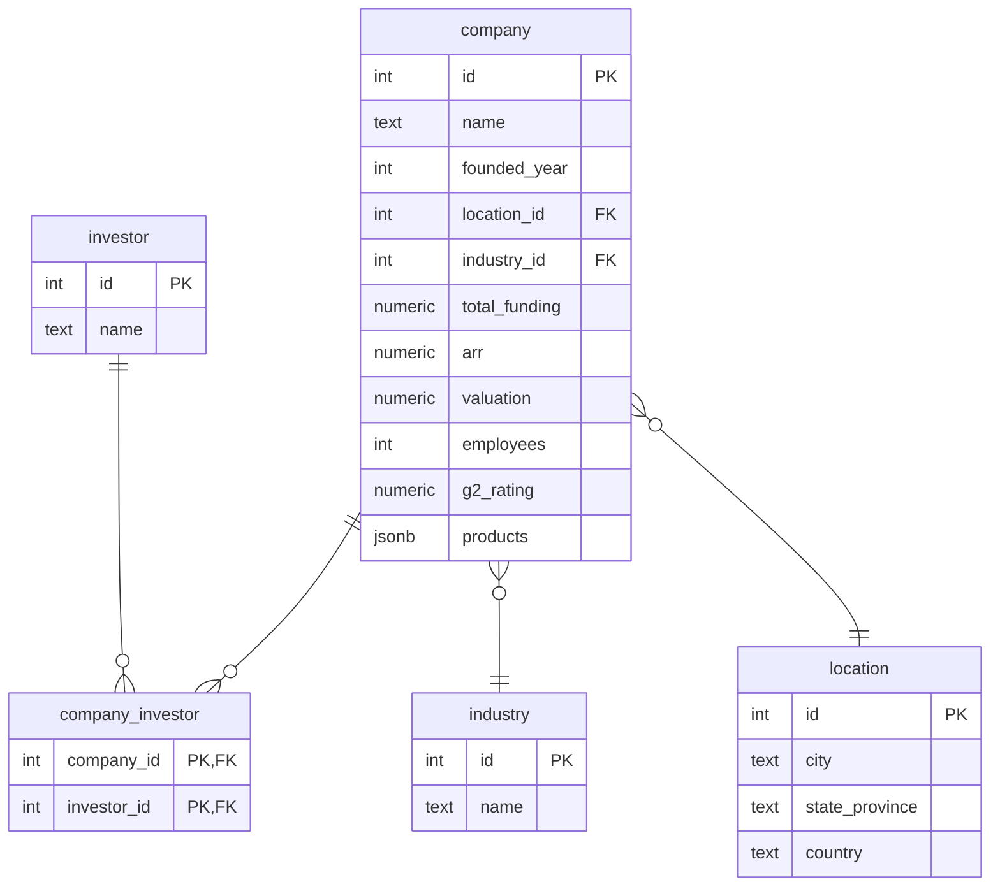

# Modelo de Datos SaaS Analytics

Este documento describe el modelo de datos normalizado utilizado en la base de datos PostgreSQL para el sistema SaaS Analytics.

## Tablas principales

- **company**: Información principal de la empresa SaaS.
- **industry**: Catálogo de industrias/segmentos.
- **location**: Ubicación normalizada (ciudad, estado/provincia, país).
- **investor**: Catálogo de inversionistas.
- **company_investor**: Relación N:M entre empresa e inversionista.

## Esquema de tablas

### company
- id (PK, serial)
- name (text, único, NOT NULL)
- founded_year (integer)
- location_id (FK → location.id)
- industry_id (FK → industry.id)
- total_funding (numeric, puede ser NULL)
- arr (numeric, puede ser NULL)
- valuation (numeric, puede ser NULL)
- employees (integer, puede ser NULL)
- g2_rating (numeric(2,1), puede ser NULL)
- products (jsonb, puede ser NULL)  # Lista de productos en formato JSON

### industry
- id (PK, serial)
- name (text, único, NOT NULL)

### location
- id (PK, serial)
- city (text, NOT NULL)
- state_province (text, NULLABLE)
- country (text, NOT NULL)

### investor
- id (PK, serial)
- name (text, único, NOT NULL)

### company_investor
- company_id (FK → company.id, PK)
- investor_id (FK → investor.id, PK)

## Relaciones
- Una empresa pertenece a una industria y a una ubicación.
- Una empresa puede tener varios inversionistas (relación N:M).
- Los productos de la empresa se almacenan como un arreglo JSON en la tabla company.

## Diagrama Entidad-Relación (ER)

